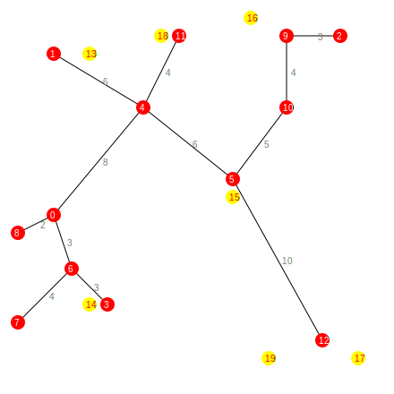

# Repository Overview

This repository offers a streamlined implementation of Prim's algorithm for calculating the MST cost in fully connected graphs, supported by a Rust program for generating comprehensive test cases. This combination ensures a robust evaluation of the algorithm's performance under various conditions, demonstrating the practical application of theoretical computer science principles to a specific class of graph problems.

> Nodes in red are nodes within the partial MST, and in yellow, nodes from the base graph excluded from the MST.

  

### Content

This repository is divided into two main components:

- `c/`: This directory contains a C implementation of Prim's algorithm in a simplified form. It calculates the cost of the Minimum Spanning Tree (MST) for a subset of vertices from a fully-connected base graph. The implementation is validated through various test cases to ensure its correctness and efficiency.
- `src/`: Houses a Rust program designed to generate test cases. These test cases are crucial for the C program, providing the scenarios necessary to evaluate the MST cost computation of the provided subgraph of a fully-connected graph.

## Commands

`make build`: build executable from the C code.

`cargo run -- -h`: display the help menu of the Rust program CLI. Use this to see all available options.

## Prim's Algorithm for Fully Connected Graphs

The implementation of Prim's algorithm provided here is tailored specifically for fully connected graphs. It focuses on calculating the length of the MST without maintaining the set of edges of the minimum spanning tree, as the structure of the MST is not our primary concern. Importantly, even though the algorithm processes the MST of the subgraph of unvisited nodes, it requires the total number of nodes in the base graph to properly initialize array sizes.

### Simplifications Due to Graph Completeness

Given the complete (fully connected) nature of the base graph, where each vertex is connected to all others, the implementation does not utilize a priority queue. This decision is grounded in the algorithm's theoretical analysis and its practical implications for computational complexity.

#### Theoretical Considerations

Drawing from Christine Solnon's teachings, consider a graph with `n` vertices and `p` edges, where the algorithm iterates `n - 1` times through a loop. Each iteration involves finding the unvisited vertex with the lowest cost in the `minCostfrom` array and examining all adjacent edges. If unvisited vertices are stored in a simple array or list, the complexity reaches `O(n^2)`. Utilizing a priority queue (binary heap) could theoretically reduce complexity to `O(p.log(n))` due to constant-time access and the need to update the heap whenever `minCostfrom` is modified. Since there could be up to `p` updates (one per edge), Prim's algorithm's complexity in such a case would indeed be `O(p log n)`.

However, for a fully connected graph with `p = n(n - 1)/2`, this approach would yield a complexity of `O(n^2.log n)`, which is less efficient than `O(n^2)`. Hence, the implementation specifically **avoids using a priority queue**, optimizing for the special case of fully connected graphs where a simpler, more direct approach suffices.
